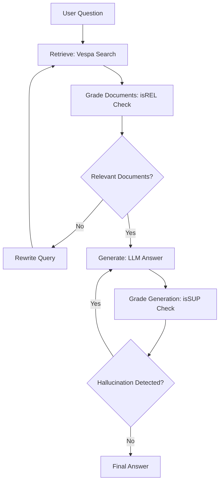

# Self-RAG Turkish Educational Q&A System

A Self-Reflective Retrieval-Augmented Generation (Self-RAG) system for Turkish educational content using MEB (Turkish Ministry of Education) documents.

## 🎯 Features

- **Self-RAG LangGraph Implementation**: Includes isREL (relevance) and isSUP (hallucination) controls
- **Turkish PDF Processing**: PyMuPDF with Turkish character support
- **Vespa Vector Database**: High-performance vector search and retrieval
- **Local LLM**: Ollama llama3.2:1b model for Turkish language support
- **Chainlit Web UI**: Interactive web interface for easy access
- **Interactive Terminal**: Command-line question-answer interface
- **Setup Automation**: Automated system verification and setup

## 📁 System Architecture

```
self_rag/
├── config.py              # System configuration
├── main.py                # Main pipeline class (InteractiveSelfRAG)
├── app_chainlit.py        # Web UI (Chainlit)
├── chainlit.md            # Chainlit welcome screen
├── setup.py               # System setup and verification
├── src/
│   ├── pdf_processor.py   # PDF processing (PyMuPDF)
│   ├── chunking.py        # Document chunking
│   ├── embeddings.py      # Local embedding model
│   ├── vespa_official.py  # Vespa vector database client
│   ├── llm_client.py      # Ollama LLM client
│   └── self_rag_graph.py  # Self-RAG LangGraph implementation
├── requirements.txt       # Python dependencies
└── .chainlit/             # Chainlit configuration
```

## 🔧 Installation

### 1. Prerequisites

```bash
# Python 3.9+ required
python --version

# Install Docker (for Vespa)
docker --version

# Install Ollama
curl -fsSL https://ollama.ai/install.sh | sh
ollama serve  # Run in separate terminal
ollama pull llama3.2:1b
```

### 2. Project Setup

```bash
# Navigate to project directory
cd self_rag/

# Create virtual environment
python -m venv venv
source venv/bin/activate  # Linux/Mac
# or
venv\Scripts\activate     # Windows

# Install dependencies
pip install -r requirements.txt
```

### 3. PDF Document Setup

```bash
# Place PDF files in the pdf_files directory
mkdir -p ../pdf_files
# Copy your MEB PDF documents to ../pdf_files/
```

### 4. System Verification (Optional)

```bash
# Run setup verification
python setup.py
```

## 🚀 Usage

### Option 1: Interactive Terminal (Recommended)

```bash
python main.py
```

**Features:**
- ✨ User-friendly interactive interface
- 💡 Predefined question suggestions
- 📊 Detailed result display
- 🔄 Continuous question-answer loop
- 🧹 Automatic cleanup

**Example session:**
```
🎓 TURKISH EDUCATION SYSTEM SELF-RAG Q&A

💡 SUGGESTED QUESTIONS:
1. How is the education system organized in Turkey?
2. What criteria determine teacher qualifications?
...

❓ Enter your question (type 'q' to exit):
▶️ How is the education system organized in Turkey?
```

### Option 2: Chainlit Web UI

```bash
chainlit run app_chainlit.py
```

**Features:**
- ✅ Modern web interface with welcome screen
- ✅ Async message handling
- ✅ Comprehensive error management
- ✅ Real-time progress updates
- ✅ Customizable welcome screen via `chainlit.md`

Open in browser: http://localhost:8000

**Note:** The welcome screen content can be customized by editing the `chainlit.md` file. This file provides users with helpful information when they first access the web interface.

### Option 3: Programmatic API

```python
from main import InteractiveSelfRAG

# Create and setup pipeline
pipeline = InteractiveSelfRAG()
pipeline.setup_pipeline()

# Ask questions
result = pipeline.ask_question("How is the education system organized in Turkey?")
print(result['answer'])
```

## 🔧 Key Technologies & Components

| Component | Technology | Purpose |
|-----------|------------|---------|
| **PDF Processing** | PyMuPDF | Turkish character support |
| **Document Chunking** | RecursiveCharacterTextSplitter | Preserve sentence structure |
| **Embeddings** | sentence-transformers | Offline Turkish support |
| **Vector Database** | Vespa | Production-ready performance |
| **LLM** | Ollama llama3.2:1b | Local Turkish language capability |
| **Workflow** | LangGraph | Self-RAG implementation |
| **Web UI** | Chainlit | Easy deployment and interaction |

## 🔄 Self-RAG Workflow



## 📊 System Performance

- **Initial Setup**: ~77 seconds (first time)
- **Question Processing**: 5-15 seconds
- **Document Chunks**: Variable based on PDF content
- **Embedding Dimension**: 384 dimensions
- **Max Chunks per Query**: 2 (configurable)
- **Memory Usage**: ~2-3GB (LLM + embeddings + Vespa)

## ⚙️ Configuration

Key configuration options in `config.py`:

```python
# Chunking
CHUNK_SIZE = 500
CHUNK_OVERLAP = 50

# Retrieval
MAX_CHUNKS_PER_QUERY = 2

# LLM
OLLAMA_MODEL = "llama3.2:1b"
OLLAMA_BASE_URL = "http://localhost:11434"

# Embeddings
EMBEDDING_MODEL = "sentence-transformers/all-MiniLM-L6-v2"

# Vespa
VESPA_PORT = 8080
VESPA_APP_NAME = "selfrag"
```

## 🛠️ Recent Improvements

### 1. LLM Grading Enhancements
- **Improved Hallucination Detection**: More flexible system prompts
- **Content Overlap Check**: Word-based similarity verification
- **Fallback Logic**: Returns 'yes' in ambiguous cases
- **Loop Prevention**: Maximum 5 attempts to prevent infinite loops

### 2. Chainlit UI Fixes
- **Message API**: Proper async message handling
- **Error Handling**: Comprehensive error catching
- **User Experience**: Better progress indicators and feedback

### 3. Code Consolidation
- **Unified Interface**: Consolidated interactive experience
- **Clean Architecture**: Eliminated code duplication
- **Better UX**: Question suggestions and easy navigation

## ❗ Troubleshooting

### Ollama Connection Error
```bash
# Start Ollama service
ollama serve

# Check model availability
ollama list
ollama pull llama3.2:1b
```

### Docker/Vespa Error
```bash
# Check Docker service
sudo systemctl start docker
docker ps

# Check port availability
lsof -i :8080
```

### Chainlit UI Error
```bash
# Update Chainlit
pip install --upgrade chainlit

# Use different port
chainlit run app_chainlit.py --port 8001
```

### PDF Processing Issues
- Ensure PDF files are in the `../pdf_files/` directory
- Check PDF files are not corrupted or password-protected
- Verify sufficient disk space for processing

## 📝 Example Questions

```python
# Sample questions for testing
example_questions = [
    "How is the education system organized in Turkey?",
    "What criteria determine teacher qualifications?",
    "Who conducts curriculum development processes?",
    "How is the use of educational technologies ensured in schools?",
    "What arrangements exist for students with special educational needs?"
]
```

## 🎯 Important Notes

1. **Initial Setup** may take time (Vespa deployment + indexing)
2. **Docker and Ollama** services must be running
3. **PDF files** must be placed in the correct directory (`../pdf_files/`)
4. **Memory Requirements**: ~2-3GB RAM for optimal performance
5. **Turkish Focus**: System optimized for Turkish educational documents
6. **Local Operation**: Fully offline after initial model downloads

## 📞 Support & Development

### System Requirements
- Python 3.9 or higher
- Docker for Vespa vector database
- Ollama for local LLM serving
- Minimum 4GB RAM recommended

### Development Setup
1. Clone/download the project
2. Run `python setup.py` to verify prerequisites
3. Start with `python main.py` for interactive mode
4. Use `chainlit run app_chainlit.py` for web interface

### Issues & Debugging
1. Check logs for detailed error information
2. Verify all services (Docker, Ollama) are running
3. Ensure PDF files are accessible and valid
4. Test with interactive terminal first before web UI

---

**Note**: This system is specifically designed for Turkish educational content and MEB documents. For other languages or domains, configuration adjustments may be required. 
